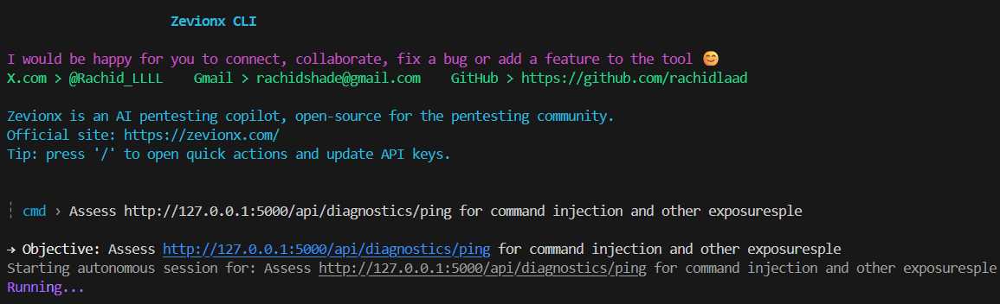

# 4myPown CLI – AI Pentesting Copilot

Official site: https://4mypawn.com/

AI-assisted penetration testing for security researchers, red-teamers, and defenders. 4myPown CLI blends an autonomous command-loop agent with a rich terminal chat experience so you can plan, execute, and report findings faster on scoped targets.

> **Authorized Testing Only**  
> Use this toolkit exclusively on systems you own or have written permission to assess. The maintainers assume no responsibility for misuse.



---

## Why 4myPown?

- **Autonomous AI Operator** – The single-shot agent (`pawn.py`) plans reconnaissance, validates commands, captures evidence, and writes a concise report.
- **Terminal Chat UI** – Rich-powered chat interface with streaming updates, context memory, a persistent “Running…” indicator, and quick actions for updating API keys on the fly.
- **Built-In Training Target** – The intentionally vulnerable **Suno** banking demo (Flask) lets you practice JWT tampering, SSRF, command injection, and file disclosure scenarios offline.
- **Safety Guardrails** – Command validator enforces allow-lists, scope restrictions, duplicate avoidance, and blocks destructive patterns.
- **Friendly Builder** – Crafted by Rachid Laad. Connect & collaborate: `X.com/@Rachid_LLLL`, `rachidshade@gmail.com`, `github.com/rachidlaad`.

---

## Table of Contents

1. [Prerequisites](#prerequisites)
2. [Quick Start](#quick-start)
3. [Configuring API Providers](#configuring-api-providers)
4. [Running the Agents](#running-the-agents)
   - [Terminal Chat UI](#terminal-chat-ui)
   - [Autonomous Single-Shot Agent](#autonomous-single-shot-agent)
5. [Practice Target: Suno Banking App](#practice-target-suno-banking-app)
6. [Outputs & Artifacts](#outputs--artifacts)
7. [Project Structure](#project-structure)
8. [Troubleshooting](#troubleshooting)
9. [Roadmap & Known Gaps](#roadmap--known-gaps)
10. [Community & Support](#community--support)

---

## Prerequisites

- **Operating System**: Linux or WSL2 on Windows (Rich UI recommended in a true terminal).
- **Python**: 3.11 or newer.
- **Optional AI keys**:
  - OpenAI API key (for GPT-4o / GPT-5 variants).
  - Google Gemini API key (gemini-1.5-flash or better).
- **Optional packages**:  
  `pip install google-generativeai openai prompt_toolkit` to unlock all provider and UI extras.

---

## Quick Start

```bash
git clone https://github.com/rachidlaad/4myPawn-CLI.git
cd 4myPawn-CLI

# 1) create and activate a virtual environment
python3 -m venv .venv
source .venv/bin/activate

# 2) install runtime dependencies
pip install -r requirements.txt

# (optional) install in editable mode for development
pip install -e .

# (optional) guided setup with provider extras
./setup.sh

# (optional) SSE/web UI dependencies
pip install fastapi aioredis

# (optional) enhanced terminal input
pip install prompt_toolkit

# (optional) vulnerable Suno target
pip install -r requirements-suno.txt
```

> The tree includes a `.gitignore` so virtualenvs, logs, and `.env` stay local—keep your real API keys out of source control.

Optional extras:
- `fastapi` + `aioredis` enable the experimental SSE API in `pown_cli/ui/sse_api.py`.
- `prompt_toolkit` adds enhanced line-editing inside the chat UI.
- `requirements-suno.txt` installs the vulnerable Suno target for local practice.

---

## Configuring API Providers

You can supply keys in two ways:

1. **Interactive Quick Actions**  
   Launch the terminal chat UI (`python3 pawn.py`) and press `/` → `1` or `/` → `2` to enter OpenAI or Gemini keys. The UI updates your environment and `.env`.

2. **Manual `.env` update**  
   Create `.env` at the project root (or edit the existing file) and add:
   ```dotenv
   OPENAI_API_KEY=sk-...
   GEMINI_API_KEY=AIza...
   ```
   Reactivate your virtualenv or restart the CLI so changes take effect.

If no provider key is present, the agent will stop with a clear “API key not configured” error before any commands run.

---

## Running the Agents

### Terminal Chat UI

```bash
# interactive chat UI with spinner, command history, and quick actions
python3 pawn.py
```

**Workflow highlights**
- Type free-form objectives to launch autonomous runs.
- Use `/help`, `/settings`, `/exec <cmd>`, `/clear`, `/context`, `/pentest`.
- The “Running…” spinner remains visible until the session finishes; command events print beneath it.
- Evidence and reports stream into the terminal; the final report is also saved to disk (see [Outputs](#outputs--artifacts)).

### Autonomous Single-Shot Agent

```bash
# single-shot agent (auto wraps bare objective into --prompt)
python3 pawn.py "Assess http://127.0.0.1:5000/api/diagnostics/ping for command injection and other exposures" \
  --provider openai \
  --max-commands 1
```

Flags mirror the options in `pown_cli.py`:
- `--provider` (`openai` | `gemini`)
- `--max-commands` safeguard

## Practice Target: Suno Banking App

Suno is a deliberately vulnerable Flask application that mirrors common web flaws without relying on SQL injection.

```bash
pip install -r requirements-suno.txt
python -m suno_app.app
# Suno runs at http://127.0.0.1:5000 by default
```

Intentional weaknesses:
- JWT role escalation (`/auth/login` & `/dashboard`)
- Command injection (`/api/diagnostics/ping`)
- SSRF (`/api/preview`)
- Path traversal (`/files/download`)

See [`README_SUNO.md`](README_SUNO.md) for walkthrough goals. Point the agent at `http://127.0.0.1:5000` for an end-to-end practice run.

---

## Outputs & Artifacts

- **Run reports**: stored in `.pown_runs/<run_id>/report.md` plus a session `run_result.json`. If you prefer to keep the working tree clean, delete or move these after review.
- **Evidence snippets**: extracted lines attached to each observation to speed up report authoring.
- **Console transcript**: use `pawn_chat.log` if you capture terminal output (ignored by git).

---

## Project Structure

```
├── pawn.py                     # Unified entry point (auto adds --prompt)
├── pown_cli.py                 # Single-shot autonomous agent & CLI
├── pown_cli/                   # Package (chat UI, orchestrator shim, helpers)
│   ├── core/orchestrator.py    # Bridges CLI orchestrator to single-shot agent
│   ├── ui/chat_ui.py          # Rich chat interface with spinner + quick actions
│   ├── ui/interactive_ui.py    # Menu-driven UI
│   ├── ui/sse_api.py           # SSE API stubs (requires optional components)
│   └── tools/                  # Safety / sandbox helpers (minimal in this fork)
├── requirements.txt            # Dependency list for quick installs
├── suno_app/                   # Vulnerable banking demo target
├── README.md                   # (you are here)
├── README_SUNO.md              # Suno target details
└── orchestration_flow.md       # Legacy architecture notes
```

---

## Troubleshooting

| Symptom | Likely Cause | Fix |
|---------|--------------|-----|
| `RuntimeError: OPENAI_API_KEY not configured` | Missing provider key | Set key via quick actions or `.env` |
| `openai.RateLimitError (429)` | Account out of quota | Add billing credits or switch provider (`--provider gemini`) |
| Spinner disappears instantly | **Fixed** in latest release – update to ensure spinner persists until completion |
| Commands rejected with `out-of-scope host(s)` | Scope validator parsing host from URL/headers | Add `--scope` flag, adjust objective, or remove out-of-scope headers |
| No output from Suno endpoints | Target app not running | Start `python -m suno_app.app` and ensure port matches your scope |

---

## Roadmap & Known Gaps

- REST/SSE orchestration server and graph memory backends are currently stubbed. Contributions welcome if you want to revive the full distributed orchestration pipeline.
- Secure sandbox module enforces validations but does not containerize tools. Integrate Docker or remote sandboxes for untrusted targets.
- More reporting templates (PDF/HTML) and remediation guidance are planned.
- Additional practice targets (beyond Suno) are in development.

---

## Community & Support

- Builder: Rachid Laadraoui  
  X/Twitter: [@Rachid_LLLL](https://x.com/Rachid_LLLL)  
  Email: [rachidshade@gmail.com](mailto:rachidshade@gmail.com)  
  GitHub: [github.com/rachidlaad](https://github.com/rachidlaad)
- Have feedback or want to collaborate? Open an issue, share ideas, or reach out directly. Bug fixes, new features, and target scenarios are all welcome.
- If 4myPown CLI helps your security workflow, star the repo so more researchers and defenders can discover this AI pentesting copilot.

Stay safe and stay ethical.

## License

4myPown CLI is licensed under the Apache License 2.0. See [LICENSE](./LICENSE).
